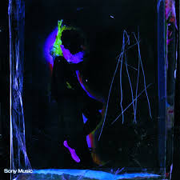

# EVIDENCIA_HTML
Carpeta de evidencia del html 

## README - Estructura del archivo `INDEX.html`

 Este archivo HTML está diseñado para mostrar una página dedicada al álbum *"Say No More"* de Charly García. A continuación explicare cada parte del código y su función. 

## Estructura general del HTML

 ```
<!DOCTYPE html>
<html lang="es">
```
- `<!DOCTYPE html>:`Le dice al navegador que este documento está usando HTML5.


## Sección `<head>`
```
<head>
  <meta charset="UTF-8" />
  <meta name="viewport" content="width=device-width, initial-scale=1.0"/>
  <title>El Álbum</title>
  <link rel="stylesheet" href="./_css/styles.css"/>
</head>
```
- `<meta charset="UTF-8" />:`Define el tipo de codificación de caracteres. UTF-8 permitiendo usar tildes, eñes y símbolos correctamente.
- `<meta name="viewport"...>:`Es clave para diseño responsive. Hace que la página se vea bien en celulares.
- `<title>:`Título de la pestaña en el navegador.
- `<link rel="stylesheet"...>:`Conecta el archivo CSS externo para darle estilo a la página.

## Encabezado principal `<header>`

```
<header>
  <h1>Say No More</h1>
  <nav>...</nav>
</header>
```
- `<header>`: Contenedor para el encabezado de la página.
- `<h1>`: Título principal de la web.
- `<nav>`: Contiene los enlaces de navegación del sitio.

## Enlaces de navegación

 ```
 <nav>
  <a href="index.html">Inicio</a>
  ...
</nav>
 ```
 - ` <a href="">:` Son los enlaces a las distintas páginas del sitio. Usan rutas relativas (./_html/pagina_X.html).

 ## Contenido principal `<main>`
 ```
 <main>
  <h2>Sobre el Álbum</h2>
  <p>...</p>
</main>
 ```
 
 - `<main>:` Define el contenido principal del sitio, lo más importante de la página.

- `<h2>:` Subtítulo o título de sección.

- `<p>:`Párrafos de texto.

##  Etiquetas semánticas y de estilo
Dentro del texto use varias etiquetas las cuales son:

- `<strong>:` Resalta texto en negrita, ideal para énfasis.

- `<em>:` Texto en cursiva.

- `<mark>:` Resalta texto como si lo marcara con un resaltador.

- `<q>:` Citas cortas, entre comillas.

- `<blockquote>:` Citas largas, generalmente destacadas.

- `<cite>:` Para nombrar autores de citas o referencias.

- `<del>:` Texto tachado, muestra cambios o cosas que fueron eliminadas.

- `<abbr title="">:` Muestra una abreviatura con su significado si pasás el mouse.

 ## Imagen del álbum
```


```

`:` Muestra una imagen.

- `src:` Es la ruta a la imagen (en este caso, carpeta _img).

- `alt:` Texto alternativo por si la imagen no carga

 - `width:` Define un ancho fijo para la imagen.

`style:` Estilos en línea como:

 - `float: right:` Coloca la imagen a la derecha del texto.

- `margin-left:`  Añade espacio a la izquierda.

- ` border:` Borde negro sólido de 2 píxeles.

## Pie de página `<footer>`

```
<footer>
  <p>&copy; 2025 Charly García.</p>
</footer>
```

- `<footer>: ` Es la sección inferior del sitio. 
- `&copy;:` Se usa para el símbolo de copyright (©).


 

 