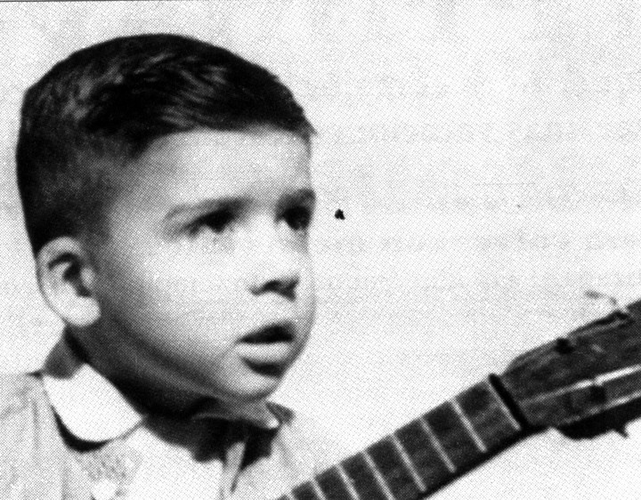

# EVIDENCIA_HTML - "Say No More" Charly García

Este sitio web está desarrollado en HTML y CSS, y esta presentado en varias páginas sobre el álbum *Say No More* de Charly García. 

---

## `index.html` - Página principal: Biografía

## Sección `<head>`
```html
<head>
  <meta charset="UTF-8" />
  <meta name="viewport" content="width=device-width, initial-scale=1.0"/>
  <title>Biografía</title>
  <link rel="stylesheet" href="./_css/styles.css"/>
  <link rel="icon" href="./_img/saynomor.jpg" type="image/x-icon">
</head>
```
- `<meta charset="UTF-8" />:` Define el tipo de codificación de caracteres. Permite el uso correcto de letras con tildes, la ñ y otros símbolos especiales.
- `<meta name="viewport"...>:` Hace que el sitio sea adaptable a distintos tamaños de pantalla (responsive).
- `<title>Biografía</title>:` Es el texto que aparece en la pestaña del navegador.
- `<link rel="stylesheet"...>:` Conecta el archivo externo de CSS para aplicar estilos visuales.
- `<link rel="icon"...>:` Asocia un ícono personalizado a la pestaña del navegador.

---

## Sección `<body>` y Encabezado
```html
<body>
  <header>
    <h1>Say No More</h1>
    <nav>
      <a href="index.html">Biografía</a>
      <a href="./_html/pagina_1.html">El Álbum</a>
      <a href="./_html/pagina_2.html">Canciones</a>
      <a href="./_html/pagina_3.html">Reflexión</a>
      <a href="./_html/pagina_4.html">Galería</a>
    </nav>
  </header>
```
- `<body>`: Es el cuerpo principal del sitio, donde se carga todo el contenido visible.
- `<header>`: Contenedor del encabezado de la página.
- `<h1>Say No More</h1>`: Título principal del sitio.
- `<nav>`: Barra de navegación.
- `<a href="...">`: Enlaces a cada sección del sitio.

---

## Menú de navegación desplegable
```html
<div class="navigation-form">
  <form action="" method="get">
    <label for="section">Ir a la página:</label>
    <select id="section" name="section" onchange="location = this.value;">
      <option value="">Seleccione la página</option>
      <option value="index.html">Biografía</option>
      <option value="./_html/pagina_1.html">El Álbum</option>
      <option value="./_html/pagina_2.html">Canciones</option>
      <option value="./_html/pagina_3.html">Reflexión</option>
      <option value="./_html/pagina_4.html">Galería</option>
    </select>
  </form>
</div>
```
- `<form>`: Formulario para seleccionar otra sección del sitio.
- `<label>`: Etiqueta descriptiva del menú desplegable.
- `<select>`: Menú que permite elegir páginas.
- `<option>`: Cada opción del menú desplegable.
- `onchange="location = this.value;"`: Hace que al elegir una opción se redireccione automáticamente.

---

## Contenido principal `<main>`
```html
<main>
  <h2>Charly García: La Historia de su Vida</h2>
  <p>Cómo su música atravesó distintos períodos políticos y sociales de la Argentina</p>
```
- `<main>`: Contenedor del contenido central de la página.
- `<h2>`: Subtítulo de sección.
- `<p>`: Párrafo de texto introductorio.

---

## Ejemplo de sección biográfica
```html
<section>
  <h2>El Nacimiento de una Leyenda</h2>
  <p>Charly García nació el 23 de octubre de 1951...</p>
  
</section>
```
- `<section>`: Divide el contenido en bloques temáticos.
- `<h2>`: Subtítulo para esta sección.
- `<p>`: Información histórica.
- ``: Imagen con ruta y texto alternativo.

---

## Pie de página `<footer>`
```html
<footer>
  <p>&copy; 2025 Charly García</p>
</footer>
```
- `<footer>`: Sección inferior del sitio.
- `<p>`: Contiene el aviso de copyright.
- `&copy;`: Muestra el símbolo ©.

---


## 📄 `pagina_1.html` - El Álbum

```html
<!DOCTYPE html>
```
- Define el tipo de documento. Especifica que se trata de HTML5.

```html
<html lang="es">
```
- Inicio del documento HTML. El atributo `lang="es"` indica que el contenido está en español.

```html
<head>...</head>
```
- Contiene metadatos como codificación, título, íconos y enlace a CSS.

```html
<meta charset="UTF-8" />
```
- Usa codificación UTF-8 para soportar caracteres como tildes y ñ.

```html
<meta name="viewport" content="width=device-width, initial-scale=1.0"/>
```
- Permite diseño adaptable (responsive).

```html
<title>El Álbum</title>
```
- Texto mostrado en la pestaña del navegador.

```html
<link rel="icon" href="../_img/saynomor.jpg" type="image/x-icon">
<link rel="stylesheet" href="../_css/styles.css"/>
```
- Ícono y hoja de estilos enlazada.

```html
<body>...</body>
```
- Contiene todo lo visible de la página.

## Sección `<header>`
- Muestra el título del sitio (`<h1>Say No More`) y una barra de navegación.

## Menú desplegable con `<form>`
- Permite cambiar entre páginas mediante un selector.

## Sección `<main>`
- Contenido principal sobre el álbum:
  - `<h2>Sobre el Álbum</h2>`: Subtítulo.
  - ``: Imagen del álbum flotando a la derecha.
  - `<p>`: Múltiples párrafos con información sobre el contexto, producción y legado del disco.
  - Uso de etiquetas como `<strong>`, `<em>`, `<mark>`, `<q>`, `<blockquote>`, `<cite>`, `<del>`, `<abbr>` para dar énfasis o estructura semántica.

## `<footer>`
- Pie de página con © 2025.

---

## 📄 `pagina_2.html` - Canciones

- Estructura casi idéntica al documento anterior en la parte de `<head>`, `<header>` y `<form>`.

## Sección `<main>`
```html
<h2>Lista de Canciones</h2>
```
- Encabezado de la sección.

```html
<ol>...</ol>
```
- Lista ordenada de canciones, con duración y breve descripción en cada `<li>`.
- Ejemplo:
```html
<li><mark>«Estaba en llamas cuando me acosté»</mark> – <small>7:04</small><br>
<em>Una de las canciones más emblemáticas...</em>
</li>
```
- Usa `<mark>` para resaltar, `<small>` para el tiempo, `<em>` para la descripción.

```html
<blockquote>...</blockquote>
```
- Frase final de Charly como reflexión global.

```html
<div class="canciones-imagen">...</div>
```
- Contenedor con dos imágenes relacionadas al disco.

---

## 📄 `pagina_3.html` - Reflexión

## Estructura
- Similar en `<head>`, `<header>` y `<form>`.

## Sección `.galeria-canciones`
```html
<section class="galeria-canciones">
```
- Contenedor general para todas las reflexiones.

```html
<div class="card-cancion">...</div>
```
- Cada reflexión está en una “tarjeta” compuesta por:
  - Imagen (``), botón “🎧 Escuchar” que enlaza a YouTube.
  - Título con nombre y duración.
  - Texto reflexivo con análisis personal o simbólico de la canción.

- Cada `<p>` usa etiquetas `<strong>`, `<em>`, `<mark>`, `<small>`, `<i>` para dar estilo al texto y diferenciar ideas destacadas.

---

## 📄 `pagina_4.html` - Galería

## Secciones principales
- Igual en estructura al resto.

```html
<h2>Galería Visual</h2>
<p>...</p>
```
- Descripción del arte gráfico asociado al artista.

```html
<div class="image-container">...</div>
```
- Contenedor con todas las imágenes.
- Cada imagen tiene un `<alt>` descriptivo.
- El diseño está hecho para mostrarse en cuadrícula usando CSS Grid.

---


#  Explicació del CSS (`styles.css`)

Este archivo define el estilo visual de todo el sitio web dedicado al álbum *Say No More*.

---

##  Estilo General del `body`
```css
body {
  background-color: #0a0a0a;
  color: #f0f0f0;
  font-family: 'Courier New', monospace;
  margin: 0;
  padding: 0;
}
```
- `background-color: #0a0a0a;` → Fondo completamente negro para toda la página.
- `color: #f0f0f0;` → Color del texto general en gris muy claro.
- `font-family: 'Courier New', monospace;` → Tipografía tipo máquina de escribir.
- `margin: 0;` y `padding: 0;` → Elimina espacios externos por defecto del navegador.

---

##  Encabezado `<header>`
```css
header {
  background-color: #1a1a1a;
  padding: 20px;
  text-align: center;
}
```
- Fondo gris oscuro.
- Espaciado interno de 20px.
- Centra el contenido del encabezado (como el título y navegación).

---

## Título principal `<h1>`
```css
h1 {
  color: #ff00cc;
  text-shadow: 0 0 10px #ff00cc;
}
```
- Color rosa fuerte (#ff00cc).
- Sombra luminosa rosa para resaltar el texto.

---

## Menú de navegación `<nav>`
```css
nav a {
  color: #00ffcc;
  margin: 0 10px;
  text-decoration: none;
  font-weight: bold;
}
```
- Enlaces de color turquesa.
- Espacio de 10px entre enlaces.
- Sin subrayado.
- Texto en negrita.

```css
nav a:hover {
  text-shadow: 0 0 10px #00ffff;
}
```
- Al pasar el mouse, se agrega un brillo azul claro como sombra.

---

## Contenido principal `<main>`
```css
main {
  padding: 20px;
}
```
- Espaciado interno para separar el texto del borde.

---

## Pie de página `<footer>`
```css
footer {
  background-color: #111;
  text-align: center;
  padding: 10px;
  font-size: small;
  color: #aaa;
}
```
- Fondo gris muy oscuro.
- Texto centrado y en gris claro.
- Fuente de tamaño pequeño.

---

## Imágenes generales
```css
img {
  margin: 10px;
  border: 3px solid #444;
  box-shadow: 0 0 10px #00ffff;
}
```
- Borde gris oscuro y sombra luminosa celeste.
- Espacio alrededor de cada imagen.

---

## Canciones - Contenedor general
```css
.canciones-contenedor {
  display: flex;
  align-items: flex-start;
  gap: 30px;
  padding: 20px;
  flex-wrap: wrap;
}
```
- Usa `Flexbox` para alinear la lista de canciones e imágenes.
- `gap: 30px` → Separación entre elementos.
- `flex-wrap` → Permite que los elementos se acomoden en varias líneas si el espacio es reducido.

---

## Lista e imagen de canciones
```css
.canciones-lista {
  flex: 1;
  min-width: 280px;
}
.canciones-imagen {
  flex: 1;
  max-width: 400px;
}
.canciones-imagen img {
  width: 100%;
  border-radius: 15px;
  box-shadow: 0 0 10px #00ffff;
}
```
- Distribuye contenido en columnas: texto a la izquierda, imagen a la derecha.
- `border-radius: 15px` da esquinas redondeadas a la imagen.

---

## Responsive para móviles
```css
@media (max-width: 768px) {
  .canciones-contenedor {
    flex-direction: column;
    align-items: center;
  }
}
```
- Si el ancho de pantalla es menor a 768px:
  - Cambia la dirección de los elementos a vertical.
  - Centra el contenido.

---

## Tarjetas de Reflexión por Canción
```css
.galeria-canciones {
  padding: 2rem;
}
.card-cancion {
  display: flex;
  flex-wrap: wrap;
  background: #1f2024;
  border-radius: 10px;
  margin-bottom: 2rem;
  box-shadow: 0 4px 10px #00ffff;
}
```
- Estructura en bloques oscuros con sombra brillante.
- Bordes redondeados y separación entre tarjetas.

---

## Imagen dentro de cada tarjeta
```css
.card-img {
  position: relative;
  flex: 1 1 300px;
  max-width: 300px;
}
.card-img img {
  width: 100%;
  height: auto;
}
```
- Cada imagen dentro de una tarjeta tiene tamaño fijo.
- Posicionamiento relativo para agregar botones.

---

## Botón “🎧 Escuchar”
```css
.boton-escuchar {
  position: absolute;
  bottom: 15px;
  left: 50%;
  transform: translateX(-50%);
  background-color: #df7676;
  color: #131111;
  padding: 0.6rem 1rem;
  border-radius: 20px;
  text-decoration: none;
  font-weight: bold;
  box-shadow: 0 2px 5px rgba(0,0,0,0.2);
}
.boton-escuchar:hover {
  background-color: #d93c58;
}
```
- Aparece sobre la imagen.
- Colores rosados que contrastan con el fondo oscuro.
- Botón redondeado, centrado y con sombra.
- Cambia de color al pasar el mouse.

---

## Texto de reflexión
```css
.reflexion-texto {
  flex: 2 1 400px;
  padding: 1rem 1.5rem;
}
.reflexion-texto h3 {
  margin-top: 0;
}
.reflexion-texto h4 {
  color: #a51e1e;
}
```
- Amplio espacio para el texto explicativo.
- Subtítulos en rojo para distinguir cada bloque.

---

## Galería Visual - Grid de imágenes
```css
.image-container {
  display: grid;
  grid-template-columns: repeat(3, 1fr); 
  gap: 10px; 
  justify-items: center; 
}
```
- Muestra 3 columnas de imágenes.
- Centra cada una y deja espacio entre ellas.

---

## Formularios de navegación
```css
.navigation-form {
  padding: 15px;
  background-color: #181515;
  border-radius: 10px;
  box-shadow: 0 4px 10px rgba(0, 0, 0, 0.1);
  width: 80%;
  max-width: 400px;
}
.navigation-form label {
  font-size: 16px;
  color: #fff;
}
.navigation-form select {
  padding: 10px;
  font-size: 16px;
  border: 2px solid #b3603073;
  border-radius: 5px;
  background-color: #9fc8d8;
  color: #070606;
}
```
- Caja redondeada con fondo oscuro.
- Selector de página estilizado en azul claro.

---


 